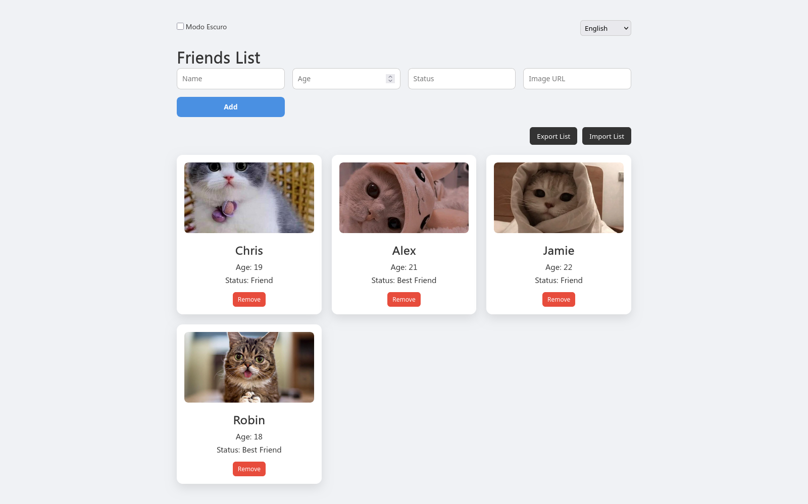

# Friends List Interactive Web App

This is a **modern and responsive web app** that allows users to create and manage a personal friends list directly in their browser. It works entirely with **HTML, CSS, and JavaScript**, so it can be hosted on **GitHub Pages** without any backend.

## Features

- **Add friends**: Users can add new friends with **name, age, status, and image URL**.  
- **Remove friends**: Each card has a remove button to delete entries.  
- **Persistent data**: Friends are saved in the browser's **localStorage**, so the list remains even after refreshing the page or closing the browser.  
- **Export and Import**: Users can export their friends list to a JSON file and import it later to restore their data.  
- **Theme toggle**: Switch between **light and dark mode**, with preferences saved in localStorage.  
- **Language toggle**: Switch between **Portuguese and English**, with all interface texts updating automatically.  
- **Responsive design**: Works well on both desktop and mobile devices.  
- **Elegant card layout**: Modern hover effects and smooth transitions make the app visually appealing.

## Screenshots

| Light Mode | Dark Mode |
|------------|-----------|
|  |  |

## How it Works

1. Open the web app in your browser.  
2. Fill in the form to add a friend.  
3. View your friends as cards in the grid layout.  
4. Use the export button to download your friends list as JSON.  
5. Use the import button to load a previously saved JSON file.  
6. Toggle between light and dark mode and switch languages as needed.  

This project is ideal for **learning front-end web development**, practicing **JavaScript DOM manipulation**, and experimenting with **localStorage** for data persistence.
